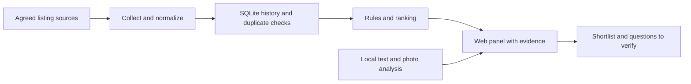

# Flat Hunter — multiple sources to a reviewable shortlist

**Personal project · Python, SQLite, APIs/HTTP, local AI, web panel**

Searching several listing sources creates duplicate records, changing prices and missing facts. Flat Hunter brings these into a local research workflow: collection → normalization and deduplication → history → ranking → human review.

## Input and output, illustrated

The rows below are invented to explain the workflow; they are not captured listings or the result of a fresh execution.

| Input | Fact available | Review action |
| --- | --- | --- |
| Source A: listing X | Rent and administrative fee given | Compare the known monthly cost |
| Source B: the same listing X | Matching listing facts | Investigate a possible duplicate |
| Source C: listing Y | Rent given; administrative fee missing | Keep the missing cost visible and ask for it |

The panel brings together candidate facts, source links, price/history information and reasons for the decision. It also exposes collection failures and unresolved information. This helps a person decide what needs follow-up.

## What this demonstrates

- Connecting several inputs to one data workflow.
- Retaining history instead of overwriting yesterday's information.
- Applying deterministic checks and making uncertainty visible.
- Presenting results in a working local interface.

For a client project, the first milestone could cover one agreed source, a stored snapshot and a table of changes. Source access, duplicate rules, acceptance checks and the delivery environment must be agreed first.

## Evidence and access

The description follows the existing project's README and its documented offline replay/parser checks. The repository and live data remain private. A live demonstration would require a separate synthetic dataset; this page is a workflow presentation rather than an application screenshot or accuracy benchmark.
