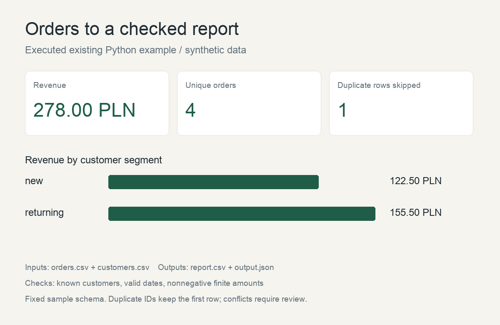

# Orders to a checked report

**Existing personal example · Python · synthetic e-commerce exports**

Two exports contain order amounts and customer segments. One order appears twice. Adding
all input amounts would count that order twice; a repeatable report needs an agreed duplicate
policy and a check that each customer reference exists.

## Executed result

On 2026-10-08 the existing reporting script produced **4 unique orders**, skipped **1 duplicate
row**, and calculated **278.00 PLN** in revenue: **122.50 PLN** for new customers and
**155.50 PLN** for returning customers. These are invented sample amounts, not client results.

- Inputs: [orders.csv](report-data/orders.csv) and [customers.csv](report-data/customers.csv).
- Outputs: [report.csv](report-data/report.csv) and [output.json](report-data/output.json).
- [Existing reporting script](report-data/run.py).

Run `python run.py` beside the input files. The script checks the expected count and total
for this sample. The image renders its output; it is not a screenshot of a client's system.

## Client application

A first milestone can cover two specified exports, their join key, an agreed duplicate policy
and one summary report. Delivery includes the result, repeatable processing and run instructions.
Reporting and e-commerce analysis at LPP, and data-product work at Wakacje.pl, provide the
professional background for this service. Employer implementations and data remain private.

## Limits

This example uses fixed CSV columns, one currency and four orders. It does not show profit,
returns, taxes or a live shop integration. Invalid dates, amounts and customer references stop
the run. Repeated order IDs keep the first row; conflicting duplicates are not compared, and
duplicate customer IDs require a separate input check. Production scope must address these
conditions and confirm what each amount means.
